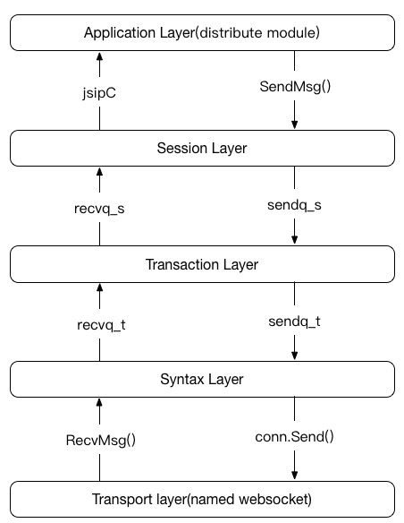

# JSIP Stack
---
The implement of JSIP Stack is in rtclib/jsip.go. The whole stack is according to SIP protocol layer. Consider JSIP is a SIP like protocol, it has stateful part, such as invite session, and stateless part, such as message session. we use GO channel as a msg queue between layers to guarantee msg sequence.

## JSIP Stack layers

JSIP stack run in one go routine, it has 3 layers in stack.

- syntax layer:

	Decode json to inter-jsip msg, syntax and necessary jsip header check, Encode inter-jsip msg to json.

	The syntax layer will block msg whose syntax is error.

- transaction layer:

	A jsip request and it's respone consist of a jsip transaction. A transaction has several provision response whose code is between 100 to 199, and one final response between 200 to 699.
	
	The transaction layer deal with transaction state transfer, blocking unexpected msg.

- session layer:

	The session layer deal with session state transfer, blocking unexpected msg.
	
	The JSIP session has default session and invite session:
	
	- default session: stateless session, such as SUBSCRIBE, MESSAGE, OPTIONS, REGISTER
	- invite session: it's develope to resolv a phone call scenario, use JSIP message: INVITE, ACK, BYE, CANCEL, UPDATE, PRACK and so on

## Syntax layer

### Recv

When receive a msg from websocket channel, syntax layer will decode msg to inter-jsip msg struct.

For request msg, "Type" header must be set within [INVITE, ACK, BYE, CANCEL, REGISTER, OPTIONS, INFO, UPDATE, PRACK, SUBSCRIBE, MESSAGE]

For response msg, "Type" header must be set with RESPONSE, and "Code" header must be set between 100 and 699

"From", "To", "DialogueID", "CSeq" must be set

### Send

When send a msg to websocket channel, syntax layer will fill RawMsg with inter-jsip msg struct mandatory header. And encode RawMsg to json

## Transaction layer

Trasaction layer include transaction state check and transfer, abnormal process and special process.

Abnormal process, when receive error msg in wrong transaction state, jsip stack will terminate transaction or ignore abnormal msg. when a request timeout when waiting for a response, jsip stack will entry transaction timer handler to terminate transaction.

Special process help top layer to reduce complexity:

- If receive CANCEL, jsip stack transaction layer will send CANCEL_200 and 487 for the request cancelled. User should not care about these flow.
- If receive BYE, jsip stack transaction layer will send BYE_200. User should not care about these flow.
- If receive abnormal finalize respone whose code between 300 and 699, jsip stack transaction layer will send ACK for these response
- If receive CANCEL_200, jsip stack transaction layer will Ignore it
- If receive BYE_200, jsip stack transaction layer will Ignore it

These actions are stardard actions, but have nothing to do with user service

## Session layer

Session layer include session state check and transfer, abnormal process and special process.

Abnormal process, when receive error msg in wrong session state, jsip stack will terminate session or ignore abnormal msg.

Special process on session layer is session timer in INVITE session. When a call is establishing, session as UAC will send UPDATE for maintain a call for peer abnormal exit; session as UAS will wait UPDATE and send UPDATE_200 in session layer. If peer abnormal exit, jsip stack session layer can terminate session resource.