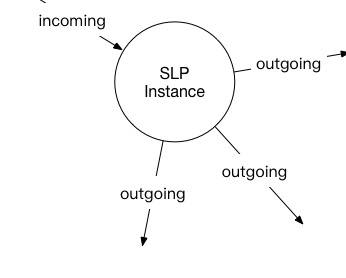

# Task
---
Task is a distribute module.

## Message Driven

Go rtc server is a message driven system, when go rtc server receive a message from websocket channel, it sends to SLP instance by calling SLP entry func. SLP func can deal with this message.

## Basic Service Module

Basically, a new incoming session will create a SLP instance. SLP instance can send one or more new outgoing session to other node. Every session related to SLP, we call it leg, SLP instance deal with the relation of all legs, such as message transit, paras modification and so on.

Examples:

User A called a 400 number, this number related to 3 agents to deal with client business. SLP instance will call these agents one by one until one agent answer.

These 4 legs will transit many messages, go rtc server can distributes these messages to the correct SLP instance by session DialogueID.

## Service Logic Select

We could load several SLP plugins in a go rtc server, how go rtc server select correct SLP to process a jsip session.

When we load slp plugin in go rtc server, we indicate a slp name, imas for example. Then we should set Router header in jsip MESSAGE like

	Router: imas.test.com;type=imas

Go rtc server receive MESSAGE, and select SLP according to first Router header's type para to select SLP. It will create a imas slp instance and bind session DialogueID with the instance. Then send MESSAGE to this instance.

If Router header or Router header's type para not set, go rtc will select SLP named default.

If plugin not load, it will retrurn 404 for the jsip request.

## Relate Incoming Session

In some scenario, we need to related some incoming jsip session to one instance, conference for example. So we add a feature, when first incoming jsip session request has Router header with para relid, we use relid as key to find slp instance instead of DialogueID.

So we can related some incoming jsip session to one slp instance.